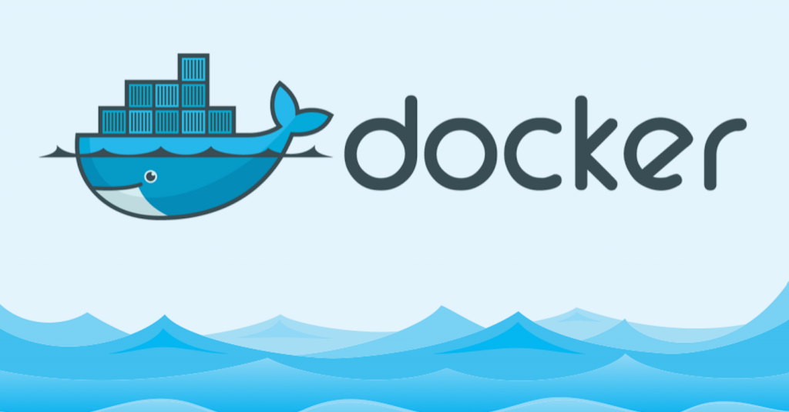

# An Introduction to Containers with Docker



Presentation Link: [click here](ppt/Introduction_to_containers.pdf)

## Docker Installation:

For Linux: [click here](docs/Installing_Docker_on_Linux.md)

For Windows: [click here](docs/Installing_Docker_on_Windows.md)

For Mac: Either follow the Windows guide to download docker toolbox, otherwise download the official version from [docker.com](https://www.docker.com/)

## Dockerfile Examples

Dockerfile to build redis ([redis.io](redis.io)) server docker image:

```dockerfile
FROM alpine

RUN apk add --update redis

CMD ["redis-server"]

EXPOSE 6379
```

Dockerfile to build a RESTful API on Flask:

Repo Link: [github.com/forkbomb-666/drip_irrigation_server](https://github.com/forkbomb-666/drip_irrigation_server)

```dockerfile
FROM python:3

WORKDIR /usr/src/app

COPY requirements.txt ./
RUN pip install -r requirements.txt

COPY . .

CMD [ "gunicorn", "-b :80" , "wsgi:app"]

EXPOSE 80
```

## Tools used

Code Snippets Generated using [carbon.now.sh](https://carbon.now.sh/)

Diagrams made in [draw.io](https://drive.google.com/file/d/1gIYtqY-l9Fgtt-w9G5DwA2deIkJbs627/view?usp=sharing)